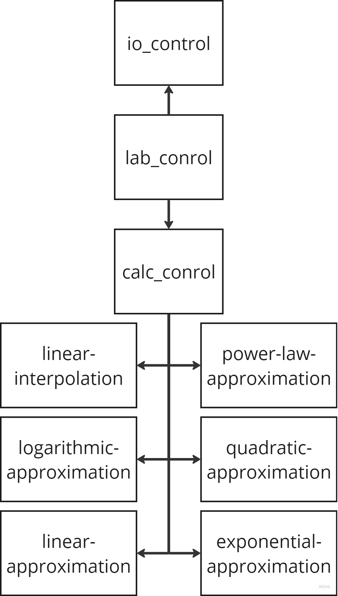

# Лабораторная работа №3

## Цель работы

Получить навыки работы с вводом/выводом, потоковой обработкой данных, командной строкой.

## Задание

В рамках лабораторной работы вам предлагается повторно реализовать лабораторную работу по предмету "Вычислительная математика" посвящённую аппроксимации (в разные годы это лабораторная работа 3 или 4) со следующими дополнениями:

- обязательно должна быть реализована линейная интерполяция (отрезками, [link](https://en.wikipedia.org/wiki/Linear_interpolation));
- настройки алгоритма аппроксимирования и выводимых данных должны задаваться через аргументы командной строки:
    - какие алгоритмы использовать (в том числе два сразу);
    - частота дискретизации результирующих данных;
    - и т.п.;
- входные данные должны задаваться в текстовом формате на подобии ".csv" (к примеру `x;y\n` или `x\ty\n`) и подаваться на стандартный ввод, входные данные должны быть отсортированы по возрастанию x;
- выходные данные должны подаваться на стандартный вывод;
- программа должна работать в потоковом режиме (пример -- `cat | grep 11`), это значит, что при запуске программы она должна ожидать получения данных на стандартный ввод, и, по мере получения достаточного количества данных, должна выводить рассчитанные точки в стандартный вывод;

## Общие требования

- программа должна быть реализована в функциональном стиле;
- ввод/вывод должен быть отделён от алгоритмов аппроксимации;
- требуется использовать идиоматичный для технологии стиль программирования.

## Выполнение

### Схема



### Реализация

- [Обработчик ввода-выхода](./src/io_control.clj)
- [Основной цикл](./src/core.clj)
- [Управление алгоритмами](./src/calc_control.clj)
- Методы
    - [Линейная интерполяция](./src/linear_interpolation.clj)
    - [Линейная апроксимация](./src/linear_approximation.clj)
    - [Логорифмическая апроксиация](./src/logarithmic_approximation.clj)
    - [Квадратическая апроксиация](./src/quadratic_approximation.clj)
    - [Степенная апроксиация](./src/power_law_approximation.clj)
    - [Экспоненциальная апроксиация](./src/exponential_approximation.clj)

### Пример работы

#### Интерактивная обработка

```
clj -M .\src\lab_control.clj 0.2 3 linearin log        
1 2
2 3
3 4
Method: Linear Interpolation
1 2
1.2 2.2
1.4 2.4
1.6 2.6
1.8 2.8
Method: Logarithmic Approximation
1 1.9370100469037668
1.2 2.261505582883831
1.4 2.5358626493319174
1.6 2.773521550351655
1.8 2.9831515576681813
+D
Method: Linear Interpolation
2 3
2.2 3.2
2.4 3.4
2.6 3.6
2.8 3.8
3.0 4.0
Method: Logarithmic Approximation
2 3.1706719891559403
2.2 3.340304853331803
2.4 3.495167525136005
2.6 3.6376273734641593
2.8 3.7695245915840907
3.0 3.8923179639402905
```

#### Потоковый режим

```
clj -M .\src\lab_control.clj 0.2 3 linearin log > hi.txt
```

cli:
```
1 2
2 3
3 4
+D
```

hi.txt:
```
Method: Linear Interpolation
1 2
1.2 2.2
1.4 2.4
1.6 2.6
1.8 2.8
Method: Logarithmic Approximation
1 1.9370100469037668
1.2 2.261505582883831
1.4 2.5358626493319174
1.6 2.773521550351655
1.8 2.9831515576681813
Method: Linear Interpolation
2 3
2.2 3.2
2.4 3.4
2.6 3.6
2.8 3.8
3.0 4.0
Method: Logarithmic Approximation
2 3.1706719891559403
2.2 3.340304853331803
2.4 3.495167525136005
2.6 3.6376273734641593
2.8 3.7695245915840907
3.0 3.8923179639402905
```

## Выводы

В процессе выполнения лабораторной работы я еще лучше разобрался с deps.
После Java, ввод-вывод мне показался мне крайне знакомым.

Для меня стало приятным удивлением, что читать и программировать Численные методы оказалось проще, чем на Java.